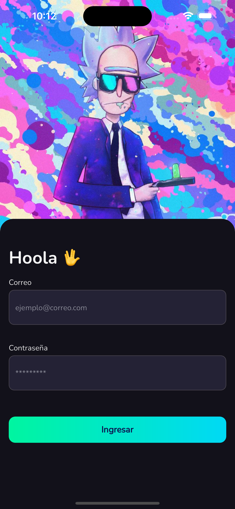
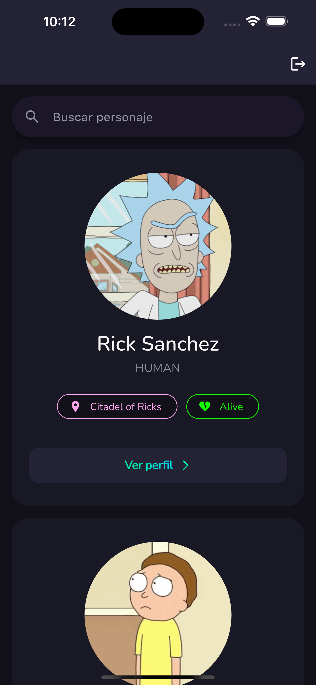

# Rick and Morty App

## Descripción

Esta es una aplicación de Flutter que muestra una lista de personajes de la serie "Rick and Morty". Utiliza la [API pública de Rick and Morty](https://rickandmortyapi.com/) para obtener la información de los personajes.

La aplicación consta de tres pantallas:

1. **Pantalla de Inicio de Sesión (Login)**: Esta pantalla valida las credenciales utilizando Firebase Authentication.

2. **Lista de Personajes**: Una vez que el usuario ha ingresado con éxito, se muestra una lista de personajes obtenidos de la API. Cada elemento de la lista muestra información básica sobre un personaje.

3. **Detalles del Personaje**: Al hacer clic en un personaje de la lista, se muestra una pantalla con detalles adicionales sobre ese personaje.

## Capturas de Pantalla




## Uso

Clona este repositorio y ejecuta:

```bash
flutter run
```

## Pruebas de Integración

Ejecutarla el comando:

```bash
flutter test integration_test/test.dart
```
